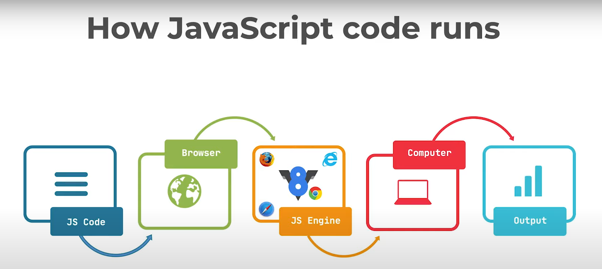
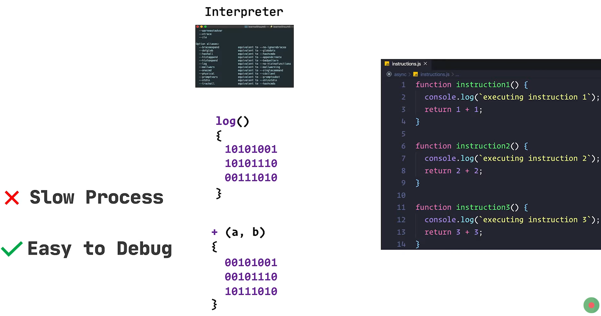
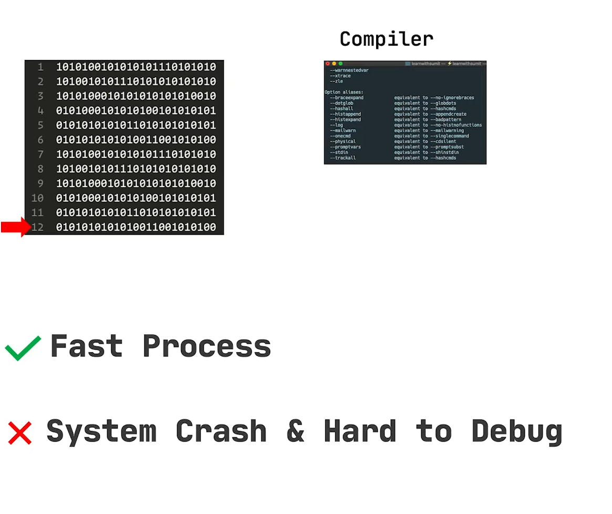
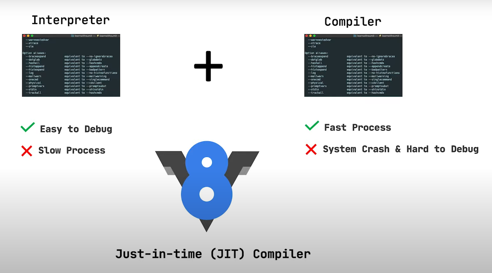

## <u> How JS code runs : </u>

- browser er moddhe ekta **JS Engine** thake

- eta amader js code k *machine language* a rupantor kore

- etar por amader computer sheta bujhte pare ebong output hishebe amra dekhte paii 

---

## <u> Interpreter  : </u>
Line by line code k ML a convert kore

---

## <u> Compiler : </u>
Pura code k ekbare ML a convert kore

---

## <u> JIT Compiler: </u>

**Just-In-Time compiler** eta easy to debug and interpreter er thike faster. eta **v8 engine** use kore

- JIT shurute amader code er kichu kore na. code jmn ase temonii rekhe dei

- amra jokhn kono **function** call kori. she tokhn oitake ML a convert korbe ebong execute korbe (just-in-time)