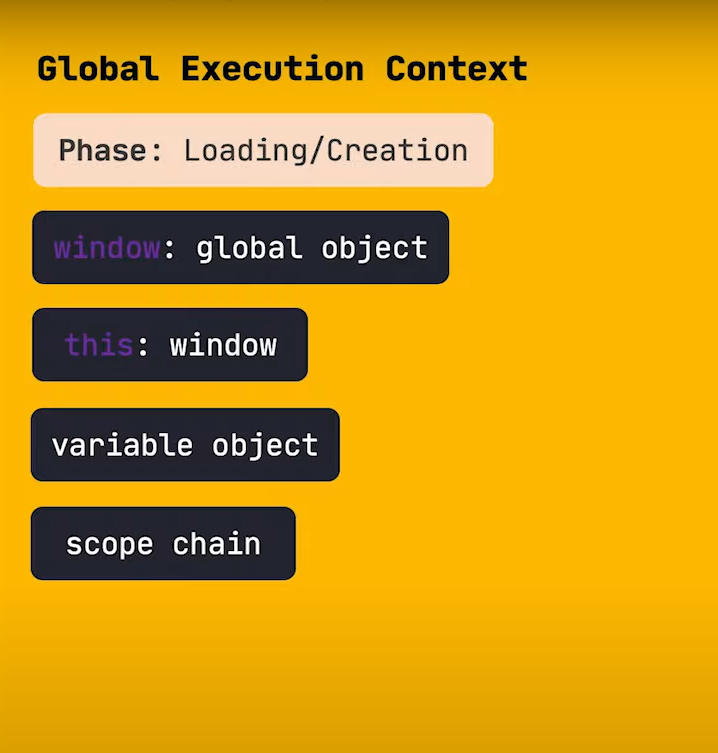
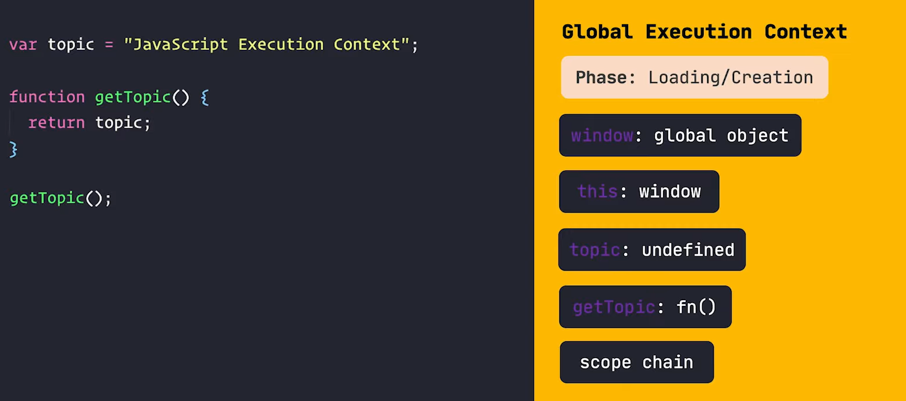
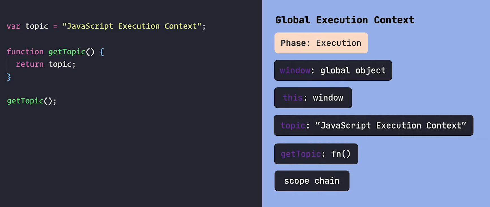
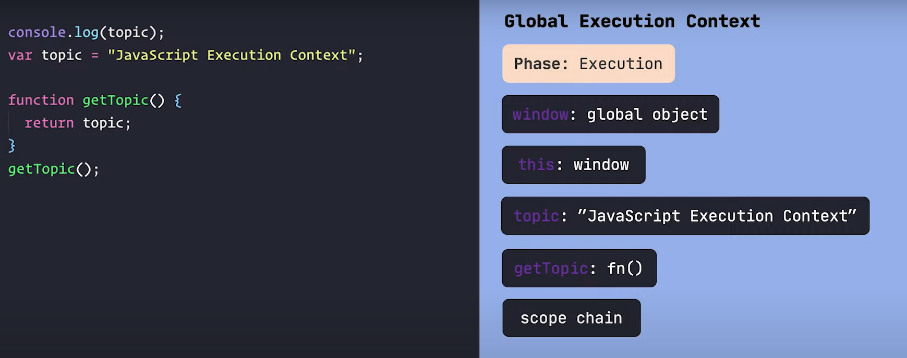

## <u> Definition of Execution Context : </u> 
#### *(13 mins 14 sec)*

- JS Engine amader code k ML a convert kore

- Engine taar kaaj k easy korar jonno (complexity komanor jonno), amader code ke ekta ekta part a vaag kore niye kaj kore 

- ei choto choto part gulakei *execution context* bole

---

## <u> Global Execution Context : </u> 
#### *(15 mins 18 sec)*

- shurutei (**jokhn kono code-ii thake na**) tokhn ei Global Execution Context namok **object** toiri hoy.

- taar moddhe ei 4 ta jinish thake

- phase er moddhe *Loading/Creation* bolte ei Global Execution Context er create howata bujhacche

---

jokhn code lekha hoy, tokhn code er *variables* r *function* gula Global Execution Context er moddhe add hoy.

ei *loading phase* a variable gulate *undefine* assign kore dewa hoy

eivabe loading phase ta shesh hoy.
ei phase er por **execution** phase shuru hoy

---

## <u> Execution Phase : </u> 
#### *(19 mins 26 sec)*

- execution kora shuru hoi ebong *topic* er value ta change hoise 

---

ebar ekdom shurute `colsole.log(topic)` ta add korsi

eta kintu `undefine` print korbe, karon *loading phase* a topic er moddhe undefine assign kora hoise.

ei `undefine` tai console a print hoise

