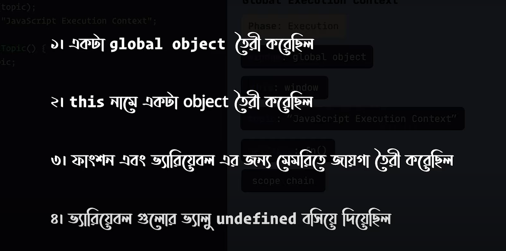
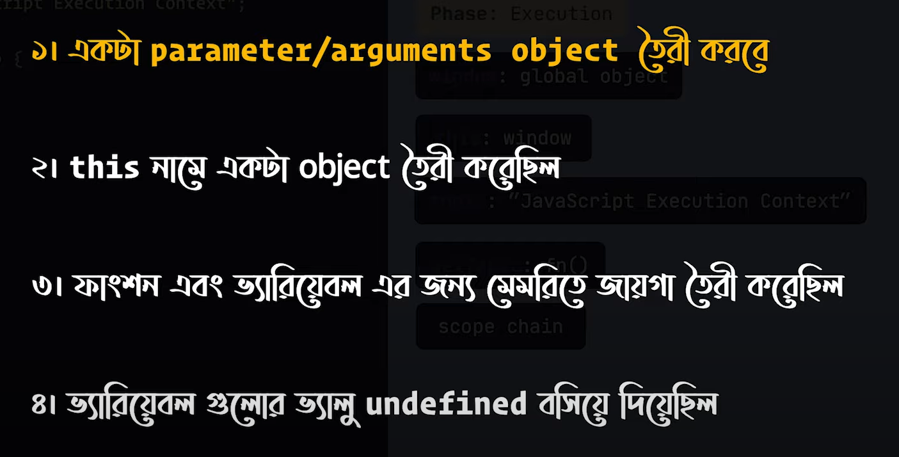
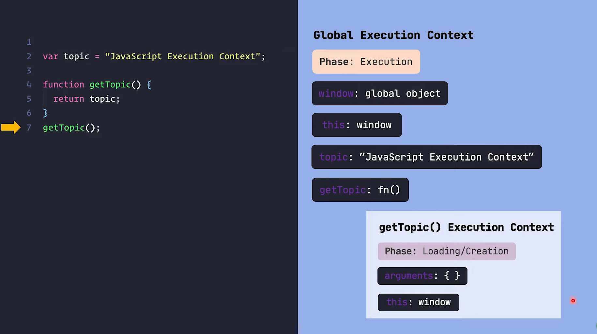

## <u> Definition of Function Execution Context : </u> 
#### *(22 mins 50 sec)*

jokhn *function* call hoy tokhn **Function Execution Context** toiri hoy

---

Global Execution Context a ja ja korechilo -

---

Function Execution Context a ja ja toiri hoy -

---   

- both GEC and FEC are objects.

- ei object gula memory er jei jaigai thake shetake **execution stack** ba **call stack** bole.

- function jokhn `return` kore tokh FEC ta stack thike remove hoy

- program shesh hole GEC tao chole jai, and execution complete hoy

---
Function Execution Context - example

