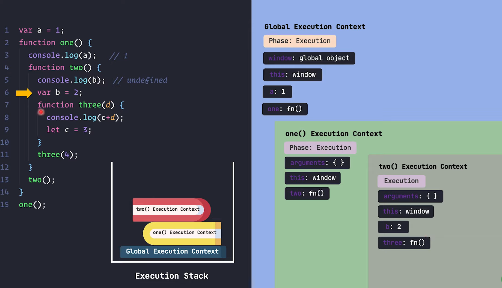
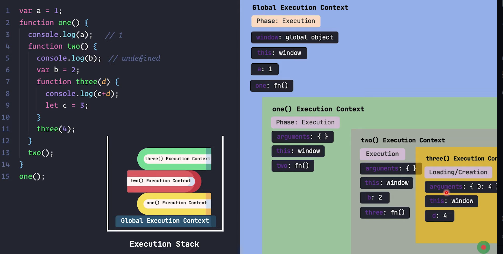

## <u> Execution Stack - Nested Functions : </u> 
#### *(30 mins 18 sec)*

1. prothome script er code porar agei amader GEC ta stack a ashe.

---

2. er por script er joto variables and functions ase, shegula ke GEC a include korbe. ekhono amra GEC er *loading phase* a asi.

--- 

3. erpor she GEC er *execution phase* a jabe.

4. line-15 a eshe FEC, stack a add hobe.

5. ei notun FEC tao shurute taar *loading phase* a thakbe

---

6. ebar `one()` function er jonno jei FEC, shetar *execution phase* a jabe.

7. `one()` function er shurutei `console.log(a)` ache. kintu ei `a` variable ta FEC er moddhe nai.

8. so eta er previous execution context (ei khetre GEC) er moddhe giye khujbe j `a` variable k pawa jai kina. jodi pawa jai tahole shekhan thike `a` er value niye print korbe

---

9. erpor line-4 thike line-12 porjonto `two()` namok function er body. shudhu jehetu body define kora so eibar kichu hobe na

10. line-13 a `two()` function ta call hoise. so ei `two()` namok function er jonno ekta FEC toiri hobe. ebong sheta *execution stack* er moddhe push hobe. ei notun FEC tao shurute taar *loading phase* a thakbe

11. erpor `two()` er jonno FEC ta *execution phase* a jabe

---

12. `two()` function er shurutei line-5 a `console.log(b)` ache. ei `b` variable ta `two()` function er FEC er moddhei ase. so FEC er moddhe `b` er j value sheta print korbe.

---

13. erporer line a `var b = 2` ache. so tokhn `two()` er execution context a thaka `b` er value `2` hobe.

---

14. erpor line-11 a `three(4)` jokhn call hobe, tokhn `three(4)` er jonno arekta FEC create hobe.

15. ebar function er jehetu parameter ache. so *argument* er moddhe parameter er value ta chole ashbe.

16. line-7 a `function three(d) {...}` theke bujha jacche j jei param ta ashbe sheta `d` namok variable moddhe assign hobe. er jonno `three(4)` er FEC ta **loading** er shomoy `d` er value ke `4` kore rakhbe

---

17. **_let_ ebong _var_ er difference :**

    - **var** data type er moto **let** loading phase a include hoy na. let include ebong assign hoy *execution phase* a.

    - line-8 a `console.log(c+d)` ache, kintu `c` variable ta assign hoise line-9 a.

    - ekhn `c` er type `let` howai eita *loading phase* a include hoy nai. ebong er jonno line-8 a *reference error* throw kortese
    
    - data type *var* hole hole variable ta loading phase a include hoito, ebong *undefine* assign kore dito. 

---

18. `let c = 3` ke jodi amra `console.log(c+d)` er age likhtam taile kono jhamela hoito na. shundor moto *three(4)* er FEC er execution phase ta shesh hoto. 

19. function jokhn return kore ba shesh hoy tokhn oi FEC ta e*xecution stack* thike shore jai