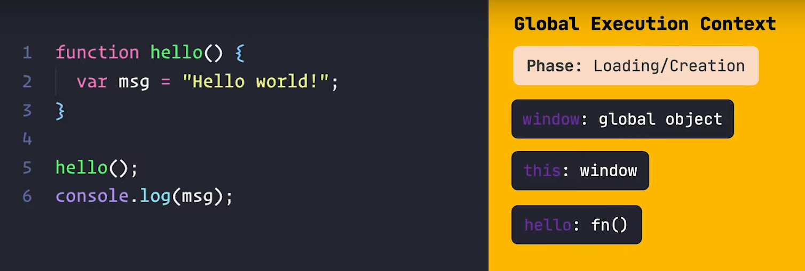
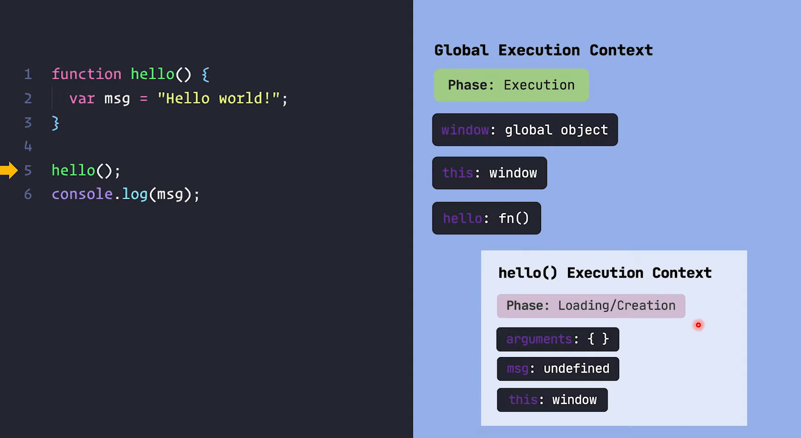
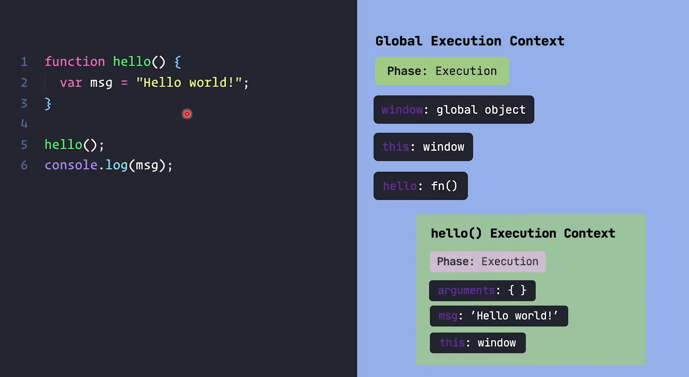
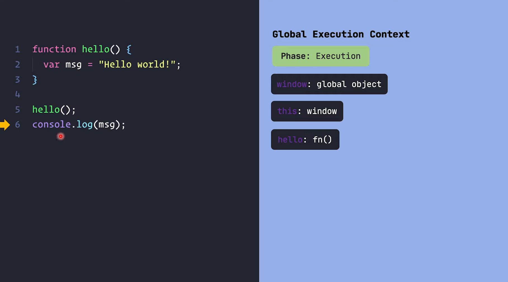

## <u> Lexical Scope: </u> 
#### *(40 mins 04 sec)*


```js
function hello() {
    var msg = "Hello World";
}

hello();
console.log(msg);
```

ei coder output ki hobe ta amra execution context er diye bujhbo.


1. prothome ekta GEC toiri hobe. ja prothome *loading  phase* a thakbe



---

2. then GEC ta *execution  phase* a jabe. okhane prothomei she function call pabe (line-5), ebong notun ekta FEC toiri korbe, eta shurute *loading  phase* a thakbe 



---

3. erpor *hello()* er FEC ta *execution  phase* a jabe ebong `msg` er value tate assign hobe



---

4. ekhn *hello()* er kaaj shesh so *hello()* er FEC ta stack thike chole jabe. chole jawar por stack er current obostha hobe erokom



5. ebar jokhn line-6 print hote jabe tokhn r `msg` variable k khuje pabe na. karon GEC a `msg` bole kichu nai. eita chilo *hello()* er FEC a, ja kina amader stack thike pop hoye gese already.

---
<br>

