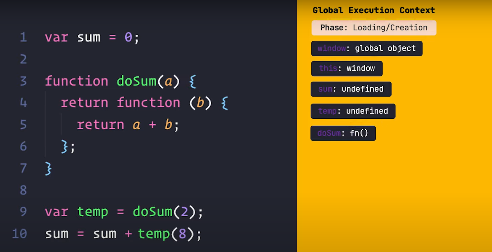
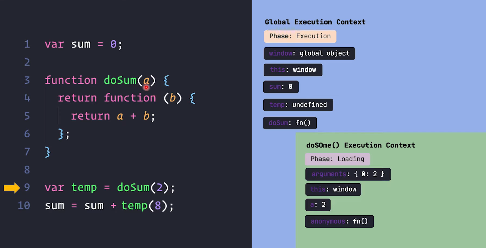
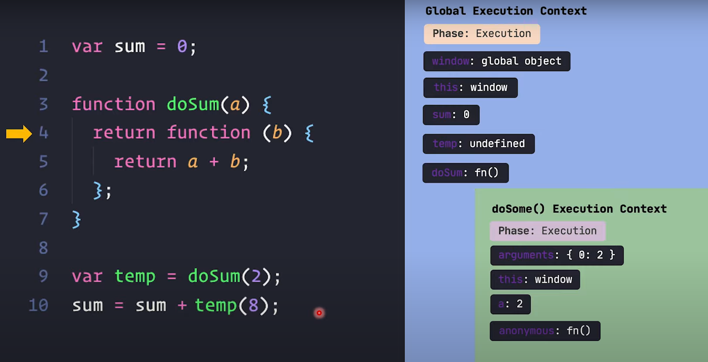
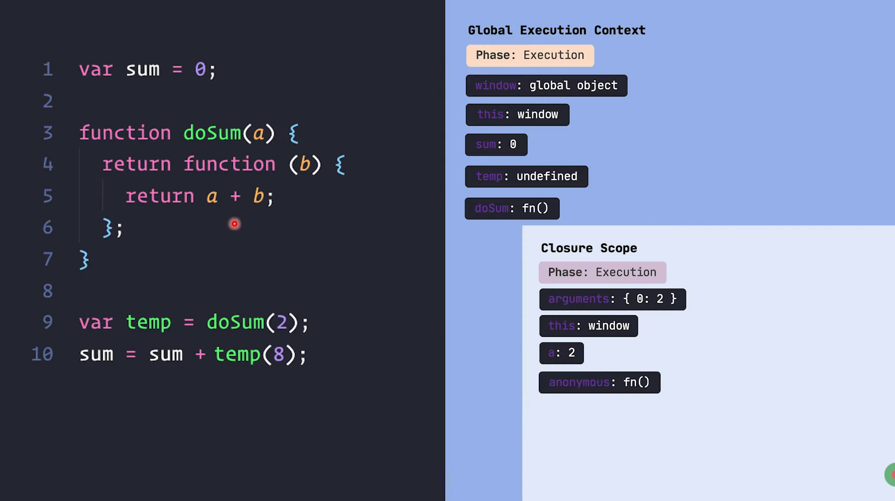
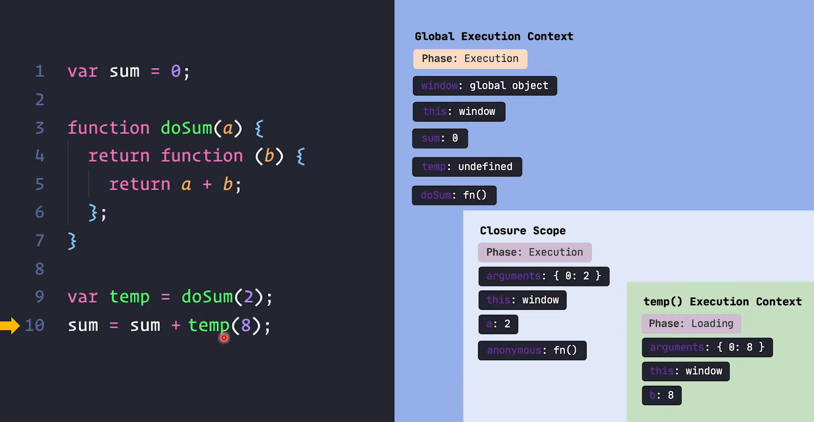

## <u> Closure: </u> 
#### *(43 mins 50 sec)*

```js
var sum = 0;

function doSum(a) {
    return function(b) {
        return a+b;
    };
}

var temp = doSum(2);
sum = sum + temp(8);
```

1. prothome GEC toiri hoy. ebong eta tokhn *loading phase a* thake. 



---

2. erpor sheta *execution  phase* a jaii. shekhane ja ja hoy :
    - GEC te `sum:0` assign hoy

    - line-9 a `temp` er value jokhn set korte jai tokhn dekhe j shekhane `doSum(2)` function call hoise. so notun ekta FEC toiri hoy

    - `doSum(2)` function ta ekta anonymous func return kore, erjonno er FEC a *anonymous* kothata ashchey

    - `doSum(2)` er FEC ta ebar *execution  phase* a jabe



---

3. execution korte giye FEC dekhbe j prothomei `return` kora hoise anonymous function takey. r `return` jehetu kora hoise so *doSum(a)* er jonno jei FEC sheta stack thike remove hoye jabe



---

4. ekhn *doSum(a)* er FEC k ekhonii stack thike remove kore dile ekta jhamela hobe :- 

    - *doSum(a)* er FEC er moddhe anonymous func ta chilo.

    - *doSum(a)* oi anonymous func takey shudhu **return** korse, anonymous func **call** ekhono hoy nai. 
    
    - so shamne jodi anonymous func k call kora lage, amra sheta korte parbo na, karon jei FEC er moddhe anonymous func ta chilo, shetai stack thike remove hoye gese

5. ei problem k solve korar jonno jeta hoy:-

    - jodi func er vitore arekta func return hoy

    - tokhn FEC remove hoye jai thik-ii

    - kintu remove howar age notun ekta **closure scope execution context** create hoy

    - ei notun **closure scope execution context** a return kora function tar properly run hote j j variable lage shegula keo include kora hoy



---

6. erpor jokhn line-10 a jai ebong oi anonymous function takey dorkar hoy. tokhn **closure scope execution context** thike niye nei 



7. line-10 `temp(8)` er jonno arekta arekta FEC create hoy, ebong pore execute hoy, then ekta ekta kore context pop hote thake